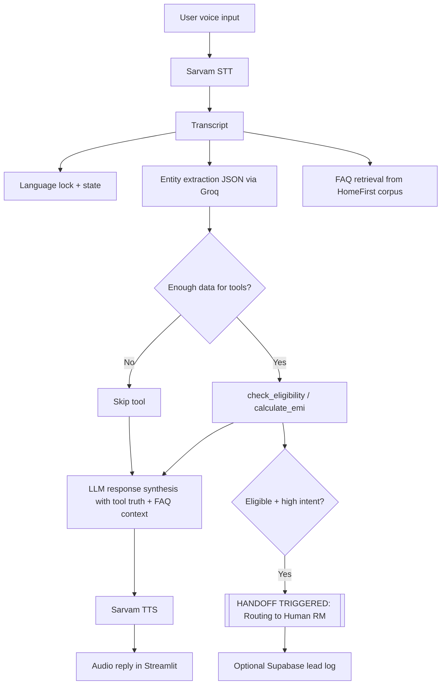

# Vernacular Loan Counselor (HomeFirst)

Voice-first Home Loan counselor prototype using:

- **Ears (STT):** Sarvam (`saarika:v2.5`)
- **Brain (LLM):** Groq with `llama-3.1-8b-instant`
- **Mouth (TTS):** Sarvam (`bulbul:v2`)
- **UI:** Streamlit (push-to-talk + upload)
- **Tools:** Deterministic `calculate_emi` and `check_eligibility`
- **RAG:** FAQ retrieval seeded from https://homefirstindia.com/faqs

## Setup Instructions

1. Create and activate Python environment.
2. Install dependencies:
   ```bash
   pip install -r requirements.txt
   ```
3. Create `.env` from `.env.example` and fill values:
   - `SARVAM_API_KEY`
   - `GROQ_API_KEY`
   - Optional: `SUPABASE_URL`, `SUPABASE_KEY`
4. Run app:
   ```bash
   streamlit run app.py
   ```

## Core System Prompt

```text
You are HomeFirst Vernacular Loan Counselor.
Rules:
1) Always respond in the locked language: {locked_language}.
2) Home-loan only. If user asks unrelated topics (personal loan, car loan, jokes, politics), politely redirect to home-loan counseling.
3) Never do eligibility math directly. Use tools.
4) Use FAQ context when user asks policy/document/process/eligibility questions.
5) Be concise and practical.
```

## Architecture & Flow Diagram



## Project Structure

- `app.py`: Main Streamlit app and stateful orchestration.
- `tools.py`: Deterministic finance tools.
- `rag_faq.py`: HomeFirst FAQ retrieval module.
- `.env.example`: Environment variable template.

## Self-Identified Issues (Architectural)

1. STT and TTS are blocking API calls in request path, creating latency bottlenecks under load.
2. Language detection is heuristic and may misclassify Marathi vs Hindi due to script overlap.
3. FAQ page extraction depends on website DOM stability; scraper may degrade if markup changes.
4. Tool-calling reliability on small LLM can be inconsistent; deterministic fallback is used but may reduce conversational flexibility.
5. Session memory is in Streamlit state only (single-process), not persistent for multi-user production usage.

## AI Code Review (Summary)

### Prompt Used

"Ruthlessly review this prototype for architecture, reliability, and safety. Score 1-10 and highlight critical improvements."

### Review Summary

- **Score:** 7.3/10
- **Strengths:** Clear modular separation, deterministic math logic to avoid hallucinated calculations, practical debug panel, and explicit language lock.
- **Weaknesses:** Limited retry/backoff for external APIs, no async pipeline, shallow intent detection, weak test coverage, and basic RAG scoring.
- **Top Fixes Recommended:** add async queue/workers for voice calls, stronger schema validation for extracted JSON, robust observability, and production-grade vector search.

## Future Improvements

### Technical

1. Move STT/LLM/TTS to async worker architecture with queue-based orchestration for lower tail latency.
2. Replace lexical retrieval with embedding-based vector DB (FAISS/Chroma) + reranking.
3. Add retries, exponential backoff, and circuit breakers for all external API calls.
4. Introduce structured logging, metrics, and trace IDs for observability.
5. Add unit tests for tool logic and integration tests for orchestration state transitions.

### Functional / Business

1. Add richer lead-scoring model (intent, affordability band, completion confidence, and conversation sentiment).
2. Add guided question flow for missing fields to improve conversion and reduce drop-offs.
3. Add policy confidence and citation snippets from FAQ to increase user trust.
4. Add human RM dashboard with call notes and recommended next-best-action.
5. Add multilingual quality evaluations with domain-specific rubric for Hinglish and regional languages.
